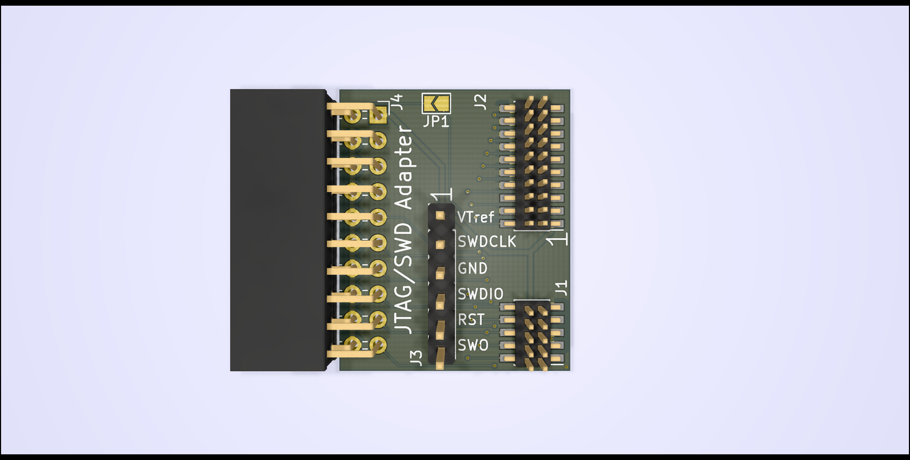
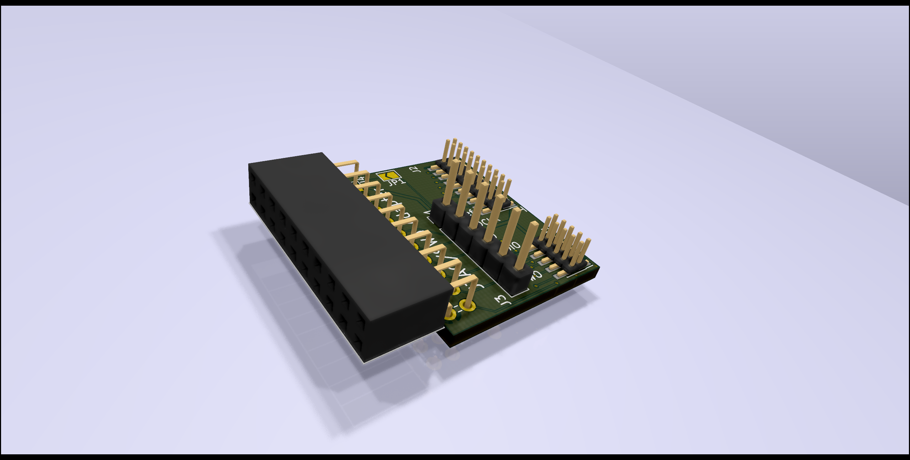

# arm-jtag-20-10-plus
KiCad project for ARM Cortex-M JTAG Adapter with 20, 10 and 6 pin target header

The adaptor can be used by a debug probe with a standard [ARM JTAG 20](http://infocenter.arm.com/help/index.jsp?topic=/com.arm.doc.dui0499d/BEHEIHCE.html) connector with 2.54 mm pitch and 2x10 pins. Like SEGGER J-Link, Olimex ARM-USB-TINY, STLINK-V3SET etc.

As target connectors, the adaptor provides a ARM JTAG 20 with 1.27 mm pitch (J2), a 10 pin SWD Cortex Debug Connector with 1.27 mm pitch (J1) and a simple 6 pin 2.54 mm pitch header for SWD (J1) according to the SWD header of the STM32 Nucleo board.